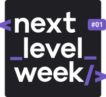

<h1 align="center">
  
</h1>

<h3 align="center">
  <strong>Next Level Week #1 - Ecoleta</strong>
</h3>
_________

### :rocket: O que é a Next Level Week?

O Next Level Week é uma semana prática com muito código, desafios, networking e um único objetivo: te levar para o próximo nível.

Através desse método a equipe da Rocketseat pretende apresentar novas ferramentas, novas tecnologias e hacks que vão impulsionar carreiras.

Um evento online e totalmente gratuito que auxilia devs a dar o próximo passo na sua evolução.

### :computer: Projeto

O Ecoleta é um marketplace que ajuda pessoas a encontrarem pontos de coleta de resíduos de forma eficiente.

### :art: Layout

  

### :boom: Tecnologias

Esse projeto foi desenvolvido com as seguintes tecnologias:

- [Node.js](https://nodejs.org/en/)
- [Express](https://expressjs.com/pt-br/)
- [SQLite](https://www.sqlite.org/index.html)
- [Nunjucks](https://mozilla.github.io/nunjucks/)

### :mortar_board: Como executar o projeto

- Faça um clone deste repositório: `git clone https://github.com/maykew/Next-Level-Week-1.git`;
- Entre no diretório Next-Level-Week-1;
- Instale as dependências : `npm install`;
- Inicie a aplicação: `npm start`;
- Acesse a aplicação pelo browser: `http://localhost:3000`;

### :family: Como contribuir

- Faça um fork desse repositório;
- Cria uma branch com a sua feature: `git checkout -b minha-feature`;
- Faça commit das suas alterações: `git commit -m 'feat: Minha nova feature'`;
- Faça push para a sua branch: `git push origin minha-feature`.

Depois que o merge da sua pull request for feito, você pode deletar a sua branch.

### :memo: Licença

Esse projeto está sob a licença MIT. Veja o arquivo [LICENSE](LICENSE.md) para mais detalhes.
_________

<h4 align="center"> ♥ by Mayke Willans ♥ </h4>